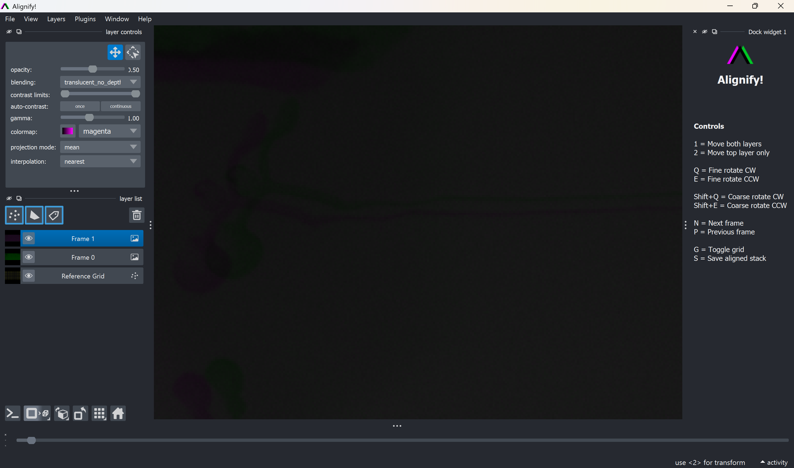

# Alignify

A manual image stack alignment tool built with Python + Napari.

---

## 🧠 What it does

Alignify lets you:
- Scroll through image stacks frame-by-frame
- Manually correct translation and rotation
- Compare adjacent frames (current vs previous)
- Save an aligned TIFF stack

**Input assumptions:** expects a single-channel (grayscale) TIFF stack of shape
`(n_frames, height, width)`. RGB or multi-channel stacks are not currently supported.

**Platform:** developed and tested on Windows. Mac/Linux users can still run it —
see the "Running the tool" section below.

---

## 🖼 Interface



*Current frame (magenta) is overlaid on the previous frame (green), with a
reference grid to help judge alignment. The controls panel on the right
lists all keyboard shortcuts.*

---

## 📦 Installation (FIRST TIME SETUP)

### Step 1 — Install Conda

Install Miniconda or Anaconda:
https://docs.conda.io/en/latest/miniconda.html

### Step 2 — Create environment

Open **Anaconda Prompt** in the Alignify folder and run:

```bash
conda env create -f environment.yml
```

---

## ▶️ Running the tool

**Windows:**
- Option 1: Double-click `run_alignify.bat`
- Option 2: Open **Anaconda Prompt** and run:
```bash
  cd path\to\Alignify
  conda activate alignify
  python alignify.py
```

**Mac / Linux:**
- The `.bat` launcher is Windows-only. Instead, activate the environment and
  run the script directly:
```bash
  cd path/to/Alignify
  conda activate alignify
  python alignify.py
```

---

## ⌨️ Controls

(Also shown in the app's right-hand controls panel.)

- `1` = Move both layers
- `2` = Move top layer only
- `Q` / `E` = Fine rotate CW / CCW
- `Shift+Q` / `Shift+E` = Coarse rotate CW / CCW
- `N` / `P` = Next / previous frame
- `G` = Toggle grid
- `S` = Save aligned stack

---

## 📄 Citation

If you use Alignify in your work, please cite:

> [Manuscript citation — add once available]

---

## License

This project is licensed under the MIT License — see `LICENSE` for details.

---

**Author:** Kristoffer Jonsson
